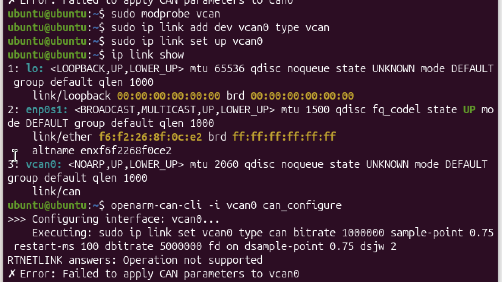
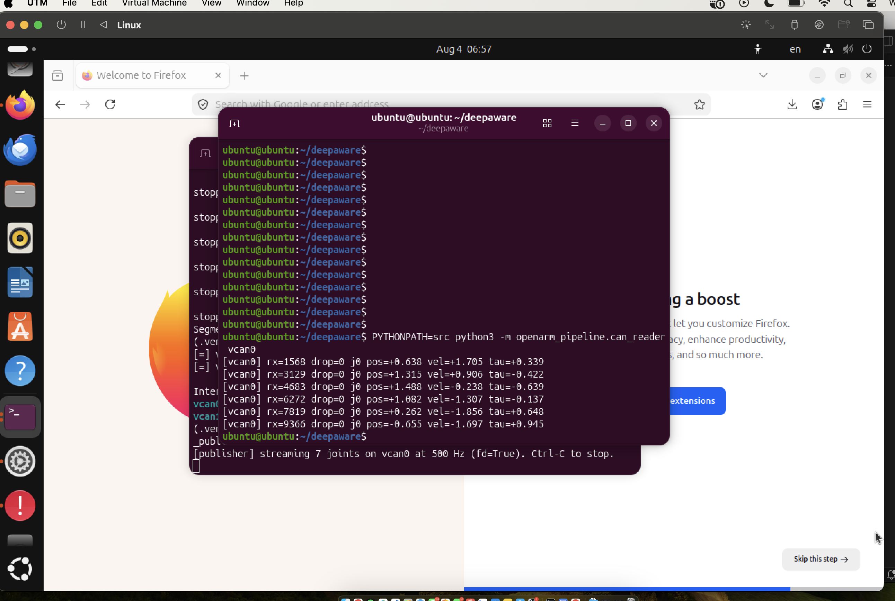

# OpenArm 2.0 — Data Collection Pipeline

> **Hardware note:** Developed without an OpenArm or a CAN-FD adapter. I used
> Linux **virtual CAN (`vcan0`/`vcan1`)** as a real SocketCAN bus and a mock
> firmware publisher to drive it, so the entire pipeline runs through the same
> code path it would use on hardware — only the frame *source* is simulated.

## Quick start

```bash
# 1. install
pip install -r requirements.txt

# 2. bring up virtual CAN (stands in for can0/can1)
bash scripts/setup_vcan.sh

# 3. run everything: mock publishers on both buses + API + dashboard
bash scripts/run_stack.sh

# 4. open the dashboard
#    http://127.0.0.1:8000
```

## Architecture

```
  vcan0 (left) ──┐                          ┌── GET /api/live        ┐
                 ├─► CanReader ──┐           ├── GET /api/live/frame  │
  vcan1 (right) ─┘   (thread)    │           ├── POST /record/start  ├─ dashboard
                                 ├► Recorder ├── POST /record/stop    │  (poll 5 Hz)
  4 cameras ──────► CameraRig ───┘  (thread) ├── GET /api/episodes    │
   (threads, async fps)                      └── GET /.../download    ┘
                                       │
                                       ▼
                              data/episodes/*.h5  (+ *.json sidecar)
```

Every source runs in its own thread and maintains a *latest-value* snapshot.
The recorder samples those snapshots on a fixed master clock. The API is a
thin read/control layer over the recorder. The dashboard polls the API.

## Task 1 — CAN setup and `can_configure`

On real hardware:

```bash
sudo ip link set can0 type can bitrate 1000000 dbitrate 5000000 fd on
sudo ip link set can0 up
openarm-can-cli -i can0 can_configure
openarm-can-cli -i can0 set_zero --arm      # repeat for can1
```

Without hardware I used virtual CAN:

```bash
sudo modprobe vcan
sudo ip link add dev vcan0 type vcan && sudo ip link set up vcan0
sudo ip link add dev vcan1 type vcan && sudo ip link set up vcan1
```

Verifying the interfaces are up:

```bash
ip -br link show type vcan 
candump vcan0                  # in one terminal
cansend vcan0 100#DEADBEEF     # in another
```



## Task 2 — CAN data reading

I don't have hardware access, so the CAN data is mocked: `can_publisher.py`
emulates the arm firmware, streaming synthetic per-joint position/velocity/
torque as real CAN FD frames onto `vcan0`/`vcan1`. `can_reader.py` — the
actual reading logic — has no idea the source is fake; it listens on the
SocketCAN interface exactly as it would against real `can0`/`can1`.

`can_protocol.py` defines the frame codec: each joint publishes an 8-byte CAN
FD payload packing position, velocity, and torque (uint16-scaled to physical
ranges) plus a rolling counter for drop detection. CAN IDs are `0x100 + joint`.

`can_reader.py` runs a background listener per bus, decodes frames into
`JointState`s, keeps a live per-joint snapshot, and counts dropped frames via
the counter.

```bash
# watch decoded joint state live (after starting a publisher)
PYTHONPATH=src python -m openarm_pipeline.can_reader vcan0
```



`rx` is the running frame count and `drop` the counter-detected gap count
(both climbing/staying at 0 confirm the read loop is healthy); `j0 pos/vel/tau`
are joint 0's live decoded position, velocity, and torque, changing every tick
as the mock publisher moves through its trajectory.

## Task 3 — Multi-camera synchronization

Four simulated cameras (wrist L/R 60 fps, ceiling 30 fps, ZED stereo 15 fps)
each run in their own thread.

**The joint stream is the master clock.** Joint telemetry is the fastest
(~500 Hz) and most latency-sensitive signal, so recording ticks are driven at
a fixed rate (default 30 Hz) and everything else aligns to those ticks.

**Cameras use zero-order hold (nearest-past frame).** At each tick we take,
per camera, the most recent frame available; slower cameras repeat their last
frame rather than blocking or interpolating.

- **No fabricated pixels.** Interpolating between frames invents image data
  that never existed — worse than an honest repeat for a robot-learning
  dataset.
- **Every frame keeps its own capture timestamp**, stored alongside the tick
  time. A downstream consumer can compute frame *age* at each tick and do its
  own resampling if it wants; we never overwrite a real timestamp with the
  tick time.


**Handling different frame rates:** since sampling happens at the tick rate,
stored frame count per camera equals tick count, the 15 fps ZED simply has
more repeated frames than the 60 fps wrist cams. Timestamp deltas make the
true underlying rate recoverable (the inspector prints "effective fps"). The
alternative which is storing each camera at its native rate and aligning lazily at
read time, saves space but pushes sync complexity onto every consumer; for a
teleoperation dataset where training wants aligned (state, image) tuples,
aligning once at write time is better.

## Task 4 — Data storage + REST API

Episodes are stored as **HDF5**, one self-describing file per episode with a
JSON sidecar for fast listing.

| Format | Justification |
|--------|----------------|
| **HDF5** | I chose this because: Single self-describing file; named groups/datasets map cleanly to arms/joints/cameras; built-in gzip; random slice access without loading the whole episode; universal reader support (h5py, MATLAB, Julia). |
| MCAP | Great for *streaming* ROS-style logs and playback, but this pipeline is episodic and array-shaped; HDF5's ndarray slicing fits robot-learning consumers (PyTorch/JAX) more directly. |
| zarr | Great for cloud/chunked parallel access to huge arrays; overkill for single-episode files on local disk and adds a directory-of-chunks rather than one portable file. |
| Parquet | Columnar tabular data is a poor fit for per-tick image tensors. |
| custom | No reason to reinvent chunking, compression, and typing that HDF5 already provides well. |

**Layout**

```
/                          attrs: episode_id, rate_hz, num_ticks, schema
├── t                      (N,)          tick timestamps, seconds
├── joint_states/
│   ├── left               (N, 7, 3)     [pos_rad, vel_rad_s, torque_Nm]
│   └── right               (N, 7, 3)
└── cameras/
    ├── wrist_left/frames      (N, H, W, 3) uint8, gzip
    ├── wrist_left/timestamps  (N,)         true capture times
    └── ... (wrist_right, ceiling, zed_stereo)
```

A small JSON sidecar per episode holds listing metadata (duration, size,
camera list) so `GET /api/episodes` never has to open the HDF5 files.

**API**

```
GET  /api/health                    service + backend status
GET  /api/live                      live joint snapshot (both arms)
GET  /api/live/frame/{camera}       latest camera preview (PNG)
POST /api/record/start              begin an episode
POST /api/record/stop               stop + flush to HDF5
GET  /api/episodes                  list episodes
GET  /api/episodes/{id}             episode metadata
GET  /api/episodes/{id}/download    download the .h5
```

Inspect a recorded episode:

```bash
PYTHONPATH=src python -m openarm_pipeline.inspect data/episodes/<id>.h5
```

## Task 5 — Monitoring dashboard

`http://127.0.0.1:8000` shows live per-joint position/velocity/torque for both
arms, frame counters and drop rate, previews from all four cameras, episode
list with downloads, and a Start/Stop recording button with an elapsed timer.
Screen recording: [docs/screenshots/dashboard.mov](docs/screenshots/dashboard.mov).

## Real-time awareness

- **Drop detection.** Each frame carries a rolling counter; the reader
  compares against the expected next value per joint and counts gaps.
  Surfaced live on the dashboard as `drop N`.
- **Non-blocking recorder.** The record loop compensates for work time so the
  tick period stays close to target (measured jitter ±0.1 ms at 30 Hz).
- **Backend isolation.** Cameras and CAN start independently — if the CAN bus
  isn't up, camera preview still works and the API reports the CAN error
  rather than failing to boot.

## Project layout

```
src/openarm_pipeline/
  can_protocol.py   frame encode/decode + JointState
  can_publisher.py  mock firmware: streams joints onto vcan
  can_reader.py     background CAN listener + drop detection
  cameras.py        4-camera simulation (async fps)
  recorder.py       master-clock sync + HDF5 writer
  api.py            FastAPI REST API + dashboard host
  inspect.py        episode inspector CLI
frontend/index.html monitoring dashboard
scripts/            setup_vcan.sh, run_stack.sh
tests/              test_pipeline.py
docs/screenshots/   Task 1 and Task 5 screenshots
```

## What I'd do next

1. Replace the mock codec with real DM-motor CAN-FD parsing against
   `openarm-can`, validated against `candump`.
2. Incremental/chunked HDF5 writes for long episodes; optional per-camera
   video encoding (H.264) instead of raw frames to cut size ~10–50×.
3. Hardware-timestamp the cameras (or a shared trigger) to tighten sync
   beyond software zero-order hold.
4. MJPEG/WebRTC live preview; per-joint plots and drop-rate graphs on the
   dashboard.
</content>
